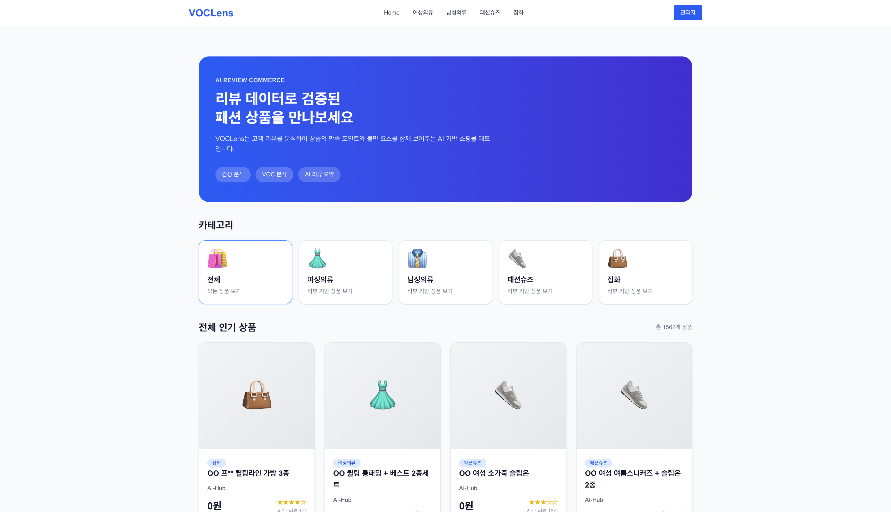
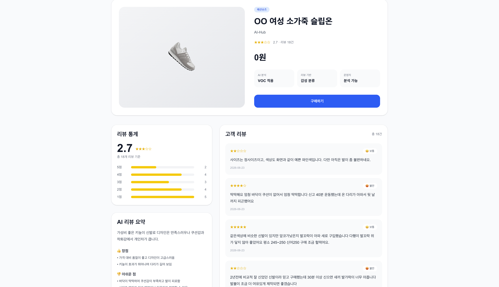
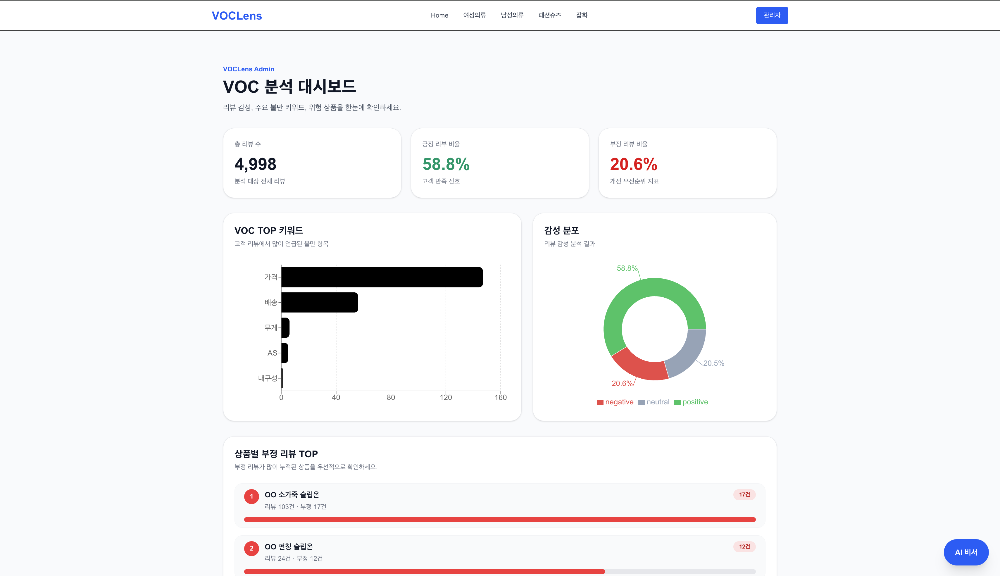
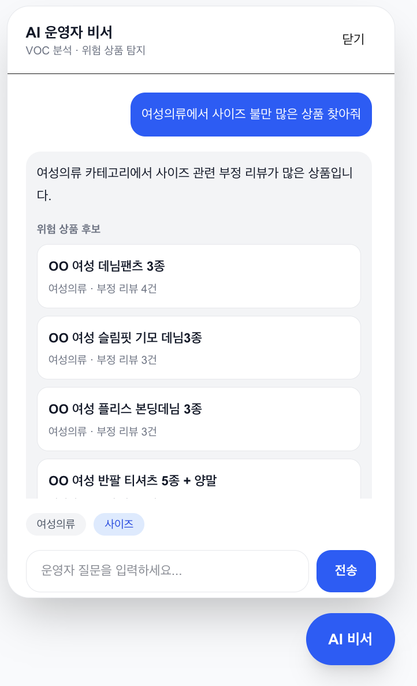
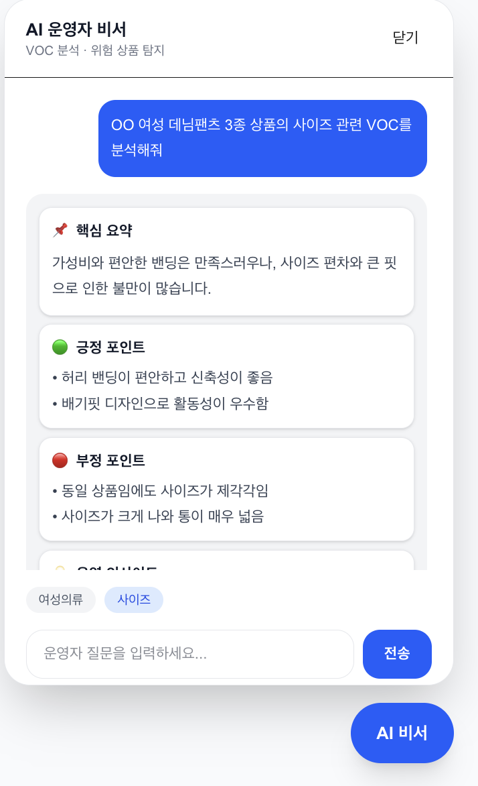

# VOCLens AI

> **AI 기반 쇼핑몰 리뷰(VOC) 분석 및 운영자 의사결정 지원 서비스**

VOCLens AI는 쇼핑몰 리뷰 데이터를 AI로 분석하여 고객의 불만사항과 만족 포인트를 자동으로 추출하고, 운영자가 자연어 질문만으로 상품별 VOC를 탐색할 수 있도록 지원하는 AI 기반 리뷰 분석 서비스입니다.

---

# 📷 Preview

## 🛍 메인 화면

사용자는 카테고리별 상품을 탐색하고 AI 기반 리뷰 분석이 적용된 상품 정보를 확인할 수 있습니다.



---

## 📦 상품 상세

상품별 평점, 리뷰 통계, AI 리뷰 요약을 통해 구매 전 장단점을 빠르게 파악할 수 있습니다.



---

## 📊 관리자 Dashboard

운영자는 KPI, 감성 분포, VOC TOP 키워드, 부정 리뷰 TOP 상품을 한 화면에서 확인할 수 있습니다.



---

## 🤖 AI 운영자 비서 - 위험 상품 탐색

자연어 질문을 기반으로 관련 상품을 탐색하고 위험 상품 후보를 추천합니다.



---

## 🧠 AI 운영자 비서 - VOC 분석

Vector Search로 검색한 리뷰를 기반으로 Gemini가 핵심 요약, 긍정 포인트, 부정 포인트 및 개선 인사이트를 제공합니다.



---

# 🚀 Demo

| Service | URL |
|---------|-----|
| Frontend | https://voclens-ai.vercel.app |
| Backend API | https://voclens-api-849548884931.asia-northeast3.run.app |
| GitHub | https://github.com/ddujeong/voclens-ai |

---

# 📌 프로젝트 소개

온라인 쇼핑몰에는 수많은 리뷰가 생성되지만 운영자가 모든 리뷰를 직접 확인하기는 어렵습니다.

기존 키워드 검색은 특정 단어가 포함된 리뷰만 조회할 수 있기 때문에 리뷰의 전체 맥락을 이해하기 어렵고, 어떤 상품을 우선적으로 개선해야 하는지 판단하기도 쉽지 않습니다.

VOCLens AI는 이러한 문제를 해결하기 위해 리뷰를 AI가 자동으로 분석하고 감성 및 VOC 태그를 분류하여 운영자가 자연어 질문만으로 관련 리뷰를 탐색하고 상품별 VOC를 빠르게 분석할 수 있도록 구현한 서비스입니다.

---

# 🎯 프로젝트 목표

- 쇼핑몰 리뷰 데이터 관리
- AI 기반 감성 분석 및 VOC 태그 분류
- 관리자 KPI Dashboard 제공
- 자연어 기반 VOC 검색
- RAG 기반 운영자 AI 챗봇 구현
- 상품별 개선 우선순위 도출

---

# ✨ 주요 기능

## 👤 사용자

- 상품 목록 조회
- 상품 상세 조회
- 리뷰 작성
- AI 기반 리뷰 요약 확인

---

## 👨‍💼 관리자

### KPI Dashboard

- 전체 리뷰 수
- 긍정 / 부정 / 중립 비율
- 감성 분포 시각화
- VOC TOP 키워드
- 부정 리뷰 TOP 상품

### VOC 분석

- 상품별 VOC 분석
- 키워드 기반 리뷰 검색
- 위험 상품 분석
- AI 기반 운영자 챗봇

---

## 🤖 AI

- TF-IDF + Logistic Regression 기반 감성 분석
- TF-IDF + Logistic Regression 기반 태그 분류
- SentenceTransformer 임베딩 생성
- pgvector 기반 Vector Search
- Gemini 기반 RAG 응답 생성
- 상품 리뷰 요약 생성

---

# 🛠 기술 스택

## Frontend

- Next.js
- TypeScript
- Tailwind CSS
- Recharts
- React Markdown

## Backend

- FastAPI
- SQLAlchemy
- Pydantic

## Database

- PostgreSQL
- pgvector

## AI

- Gemini 3.1 Flash Lite
- SentenceTransformer (paraphrase-multilingual-MiniLM-L12-v2)
- TF-IDF
- Logistic Regression
- RAG
- Vector Search

## Deployment

- Google Cloud Run
- Vercel
- Supabase

---

# ⚙ 실행 방법

## 1. 프로젝트 Clone

```bash
git clone https://github.com/ddujeong/voclens-ai.git

cd voclens-ai
```

---

## 2. Frontend 실행

```bash
cd frontend

npm install

npm run dev
```

---

## 3. Backend 실행

```bash
cd backend

pip install -r requirements.txt

uvicorn app.main:app --reload
```

---

## 4. 환경 변수

```env
DATABASE_URL=

GEMINI_API_KEY=
```

---

# 🌐 배포

| Service | URL |
|---------|-----|
| Frontend | https://voclens-ai.vercel.app |
| Backend | https://voclens-api-849548884931.asia-northeast3.run.app |

---

# 👤 테스트 계정

현재 로그인 기능은 구현하지 않았습니다.

별도의 테스트 계정 없이 모든 기능을 자유롭게 이용할 수 있습니다.

---

# 🤖 LLM / Agent 동작 구조

VOCLens AI는 반복적인 분류 작업과 생성형 AI의 역할을 분리하여 비용과 응답 속도를 모두 고려한 구조로 설계하였습니다.

리뷰 등록 시에는 직접 학습한 머신러닝 모델이 감성과 태그를 분류하고, 운영자 질문에 대해서만 LLM을 사용하는 RAG 구조를 적용했습니다.

```text
사용자 리뷰 작성
        │
        ▼
TF-IDF + Logistic Regression
(감성 분류 / 태그 분류)
        │
        ▼
SentenceTransformer
Embedding 생성
        │
        ▼
PostgreSQL(pgvector) 저장

────────────────────────────────

운영자 질문
        │
        ▼
Agent Planner
(질문 의도 분석)
        │
        ▼
Vector Search
(pgvector)
        │
        ▼
Context 생성
        │
        ▼
Gemini
        │
        ▼
VOC 분석 결과 생성
```

### AI 역할 분리

#### Machine Learning

- 감성 분류
- VOC 태그 분류

반복적으로 수행되는 작업은 직접 학습한 모델이 담당하도록 구현했습니다.

---

#### LLM

Gemini는

- 리뷰 요약
- VOC 분석
- 개선 포인트 도출

등 생성이 필요한 영역에서만 활용하도록 설계했습니다.

이를 통해 응답 속도를 높이고 LLM 호출 비용을 최소화했습니다.

---

# 🔄 데이터 흐름

```text
사용자
      │
      ▼
상품 리뷰 작성
      │
      ▼
감성 분석
(TF-IDF + Logistic Regression)
      │
      ▼
태그 분류
      │
      ▼
SentenceTransformer Embedding
      │
      ▼
PostgreSQL + pgvector 저장
      │
──────────────────────────────
      │
운영자 질문
      │
      ▼
질문 의도 분석
      │
      ▼
Vector Search
      │
      ▼
관련 리뷰 검색
      │
      ▼
Gemini
      │
      ▼
VOC 분석 결과 반환
```

---

# 💡 중점적으로 구현한 내용

### 1. TF-IDF + Logistic Regression 기반 감성·태그 분류 모델 학습

AI-Hub 패션 리뷰 데이터를 활용하여 TF-IDF + Logistic Regression 기반 감성 분류 및 태그 분류 모델을 직접 학습하였습니다.

리뷰 등록 시 자동으로 감성과 VOC 태그를 분류하여 관리자 분석 기능에서 활용할 수 있도록 구현했습니다.

---

### 2. RAG 기반 운영자 AI 챗봇

운영자의 자연어 질문을 Rule Based 방식으로 분석한 뒤 관련 태그를 추출하고 pgvector 기반 Vector Search를 통해 관련 리뷰를 검색하도록 구현했습니다.

검색된 리뷰를 Gemini에 전달하여 상품별 VOC 분석 결과와 개선 포인트를 생성하도록 구현했습니다.

---

### 3. 관리자 Dashboard

관리자가 고객 의견을 빠르게 파악할 수 있도록

- KPI Dashboard
- 감성 분포
- VOC TOP 키워드
- 부정 리뷰 TOP 상품

등을 시각화하여 제공했습니다.

---

### 4. 전체 서비스 구현

기획부터

- Frontend
- Backend
- Database
- AI 모델 학습
- RAG
- Cloud Run / Vercel / Supabase 배포

까지 전 과정을 단독으로 구현했습니다.

---

### 5. AI 비용 최적화 설계

반복적으로 수행되는 감성 분류와 VOC 태그 분류는
직접 학습한 머신러닝 모델(TF-IDF + Logistic Regression)이 수행하도록 구현했습니다.

LLM은 리뷰 요약, VOC 분석, 개선 인사이트 생성처럼 생성형 AI가 필요한 작업에서만 호출하도록 역할을 분리했습니다.

이를 통해 응답 속도를 개선하고 API 호출 비용을 최소화했습니다.

---

# ⚠ 구현하지 못한 부분

프로젝트의 핵심 기능은 모두 구현하였지만, 실제 운영 환경을 고려했을 때 아래 기능은 추가 개선이 가능합니다.

- Hybrid Search(BM25 + Vector Search)를 활용한 검색 정확도 향상
- 사용자 피드백을 반영한 모델 재학습 파이프라인 구축
- 기간별 VOC 변화 추이 분석
- 관리자 리포트(PDF) 자동 생성
- 실시간 리뷰 수집 및 분석
- 다중 쇼핑몰 데이터 통합 분석

---

# 🚀 향후 개선 방향

## 1. Hybrid Search

현재는 Vector Search 기반으로 관련 리뷰를 검색하고 있습니다.

향후에는 BM25와 Vector Search를 결합한 Hybrid Search를 적용하여 검색 정확도를 향상시킬 계획입니다.

---

## 2. AI Agent 기반 운영 자동화

현재는 운영자의 질문에 대한 분석 결과를 제공하는 수준입니다.

향후에는 AI Agent를 활용하여

- 리뷰 자동 분류
- 개선 우선순위 자동 산출
- 상품 개선 리포트 생성

등 운영 업무 일부를 자동화할 계획입니다.

---

## 3. 사용자 피드백 기반 모델 개선

리뷰 분석 결과에 대한 운영자의 피드백을 수집하여 모델 재학습에 활용하고 지속적으로 성능을 개선할 계획입니다.

---

## 4. 실시간 VOC 모니터링

실시간 리뷰 수집과 Dashboard를 연동하여 운영자가 고객 의견 변화를 즉시 확인할 수 있도록 확장할 계획입니다.

---

# 🤖 AI 개발 도구 활용

프로젝트 개발 과정에서 생성형 AI를 다양한 단계에서 활용하였습니다.

- 요구사항 분석 및 기능 설계
- API 설계 검토
- 프롬프트 설계
- 테스트 케이스 작성
- 리팩토링 아이디어 검토

다만 AI가 생성한 코드를 그대로 적용하지 않고 직접 실행 및 테스트를 통해 데이터 흐름과 예외 처리를 검증한 후 프로젝트에 맞게 수정하여 반영하였습니다.

---

# 📁 프로젝트 구조

```text
voclens-ai
├── backend
│   ├── app
│   │   ├── api
│   │   ├── core
│   │   ├── ml
│   │   ├── models
│   │   ├── schemas
│   │   ├── services
│   │   └── seed
│   └── requirements.txt
│
├── frontend
│   ├── app
│   ├── components
│   ├── services
│   ├── types
│   └── public
│
└── README.md
```

---

# 📈 프로젝트를 통해 얻은 점

이번 프로젝트에서는 단순히 LLM을 호출하는 수준이 아니라 머신러닝 모델과 RAG를 함께 활용하여 역할을 분리하는 구조를 설계하였습니다.

또한 Frontend, Backend, Database, AI 모델 학습, Vector Search, Cloud 배포까지 전체 서비스를 직접 구현하면서 AI 기능을 실제 서비스에 적용하는 전 과정을 경험할 수 있었습니다.

특히 반복적인 분류 작업은 직접 학습한 모델이 담당하고, 생성이 필요한 영역만 LLM이 수행하도록 역할을 분리하여 비용과 응답 속도를 모두 고려한 AI 서비스 구조를 구현한 것이 가장 의미 있는 경험이었습니다.

---

# 📄 License

본 프로젝트는 학습 및 포트폴리오 목적으로 제작되었습니다.
